# Задание
Вопросы по заданию
В этом разделе можно задать вопросы и получить ответ.
Преподаватель: Булат Замилов, Олег Букатчук, Руслан Жданов
Дипломный практикум в YandexCloud

### Цели:

Зарегистрировать доменное имя (любое на ваш выбор в любой доменной зоне).
Подготовить инфраструктуру с помощью Terraform на базе облачного провайдера YandexCloud.
Настроить внешний Reverse Proxy на основе Nginx и LetsEncrypt.
Настроить кластер MySQL.
Установить WordPress.
Развернуть Gitlab CE и Gitlab Runner.
Настроить CI/CD для автоматического развёртывания приложения.
Настроить мониторинг инфраструктуры с помощью стека: Prometheus, Alert Manager и Grafana.
Этапы выполнения:

## 1. Регистрация доменного имени

Подойдет любое доменное имя на ваш выбор в любой доменной зоне.
ПРИМЕЧАНИЕ: Далее в качестве примера используется домен you.domain замените его вашим доменом.
Рекомендуемые регистраторы:

• nic.ru
• reg.ru

### Цель:

Получить возможность выписывать TLS сертификаты для веб-сервера.
Ожидаемые результаты:

У вас есть доступ к личному кабинету на сайте регистратора.
Вы зарезистрировали домен и можете им управлять (редактировать dns записи в рамках этого домена).

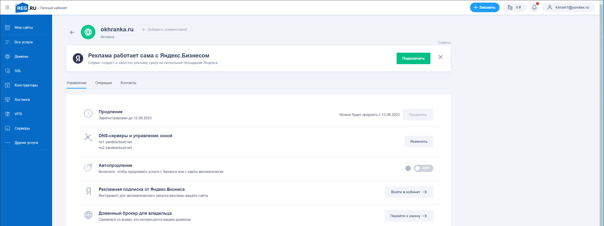

## 2. Создание инфраструктуры

Для начала необходимо подготовить инфраструктуру в YC при помощи Terraform.

Особенности выполнения:

Бюджет купона ограничен, что следует иметь в виду при проектировании инфраструктуры и использовании ресурсов;
Следует использовать последнюю стабильную версию Terraform.
Предварительная подготовка:

Создайте сервисный аккаунт, который будет в дальнейшем использоваться Terraform для работы с инфраструктурой с необходимыми и достаточными правами. Не стоит использовать права суперпользователя
Подготовьте backend для Terraform:
а. Рекомендуемый вариант: Terraform Cloud
б. Альтернативный вариант: S3 bucket в созданном YC аккаунте.

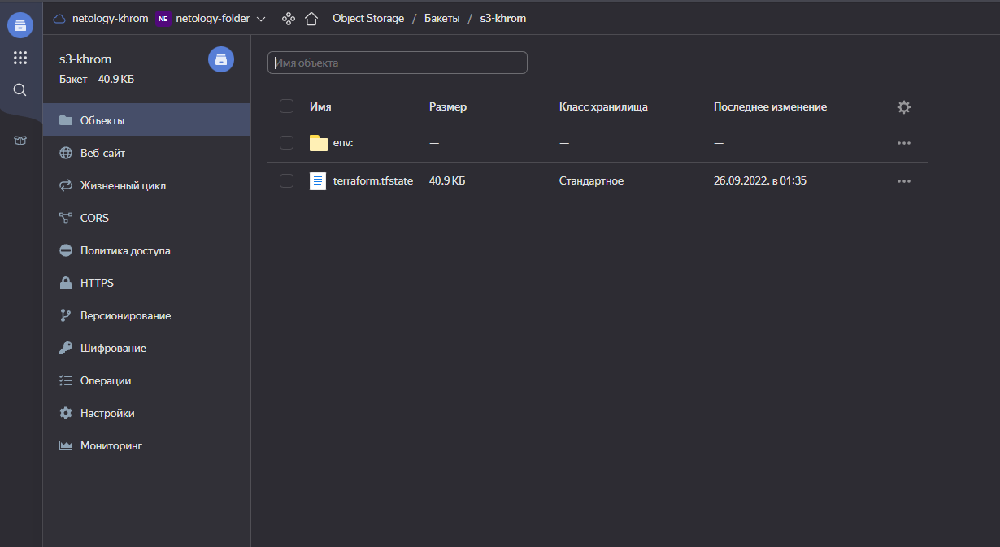

Настройте workspaces
а. Рекомендуемый вариант: создайте два workspace: stage и prod. В случае выбора этого варианта все последующие шаги должны учитывать факт существования нескольких workspace.
б. Альтернативный вариант: используйте один workspace, назвав его stage. Пожалуйста, не используйте workspace, создаваемый Terraform-ом по-умолчанию (default).

Создайте VPC с подсетями в разных зонах доступности.
Убедитесь, что теперь вы можете выполнить команды terraform destroy и terraform apply без дополнительных ручных действий.
В случае использования Terraform Cloud в качестве backend убедитесь, что применение изменений успешно проходит, используя web-интерфейс Terraform cloud.

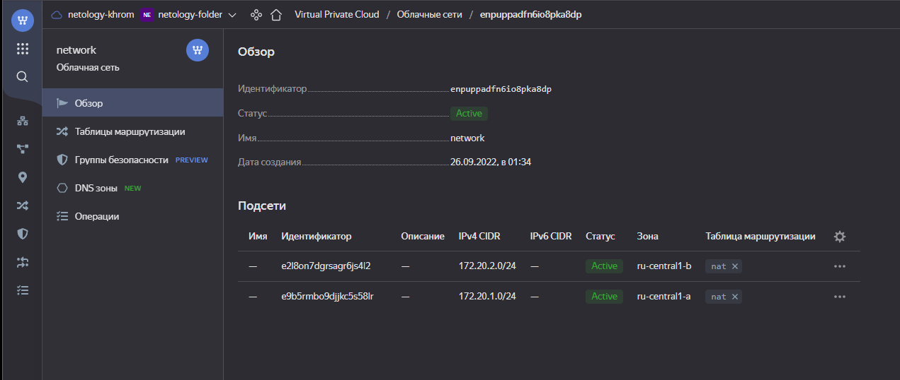

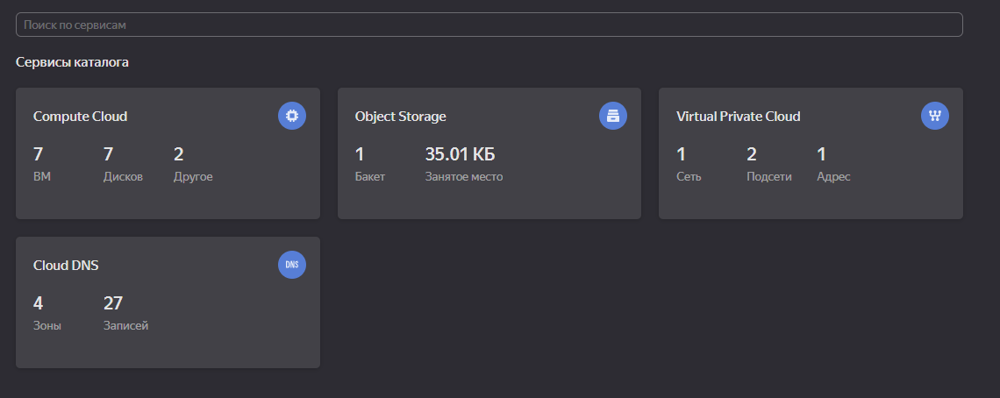
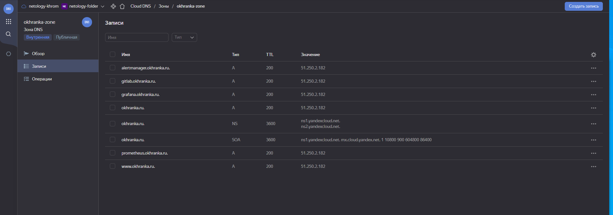

### Цель:

Повсеместно применять IaaC подход при организации (эксплуатации) инфраструктуры.
Иметь возможность быстро создавать (а также удалять) виртуальные машины и сети. С целью экономии денег на вашем аккаунте в YandexCloud.
Ожидаемые результаты:

Terraform сконфигурирован и создание инфраструктуры посредством Terraform возможно без дополнительных ручных действий.
Полученная конфигурация инфраструктуры является предварительной, поэтому в ходе дальнейшего выполнения задания возможны изменения.

## 3. Установка Nginx и LetsEncrypt

Необходимо разработать Ansible роль для установки Nginx и LetsEncrypt.
Для получения LetsEncrypt сертификатов во время тестов своего кода пользуйтесь тестовыми сертификатами, так как количество запросов к боевым серверам LetsEncrypt лимитировано.

Рекомендации:

• Имя сервера: you.domain
• Характеристики: 2vCPU, 2 RAM, External address (Public) и Internal address.

### Цель:

Создать reverse proxy с поддержкой TLS для обеспечения безопасного доступа к веб-сервисам по HTTPS.
Ожидаемые результаты:

В вашей доменной зоне настроены все A-записи на внешний адрес этого сервера:
https://www.you.domain (WordPress)
https://gitlab.you.domain (Gitlab)
https://grafana.you.domain (Grafana)
https://prometheus.you.domain (Prometheus)
https://alertmanager.you.domain (Alert Manager)
Настроены все upstream для выше указанных URL, куда они сейчас ведут на этом шаге не важно, позже вы их отредактируете и укажите верные значения.
В браузере можно открыть любой из этих URL и увидеть ответ сервера (502 Bad Gateway). На текущем этапе выполнение задания это нормально!
## 4. Установка кластера MySQL

Необходимо разработать Ansible роль для установки кластера MySQL.

Рекомендации:

• Имена серверов: db01.you.domain и db02.you.domain
• Характеристики: 4vCPU, 4 RAM, Internal address.

### Цель:

Получить отказоустойчивый кластер баз данных MySQL.
Ожидаемые результаты:

MySQL работает в режиме репликации Master/Slave.
В кластере автоматически создаётся база данных c именем wordpress.
В кластере автоматически создаётся пользователь wordpress с полными правами на базу wordpress и паролем wordpress.
Вы должны понимать, что в рамках обучения это допустимые значения, но в боевой среде использование подобных значений не приемлимо! Считается хорошей практикой использовать логины и пароли повышенного уровня сложности. В которых будут содержаться буквы верхнего и нижнего регистров, цифры, а также специальные символы!

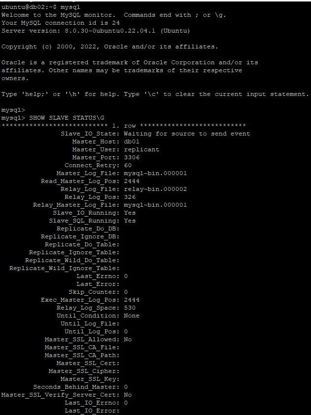

## 5. Установка WordPress

Необходимо разработать Ansible роль для установки WordPress.

Рекомендации:

• Имя сервера: app.you.domain
• Характеристики: 4vCPU, 4 RAM, Internal address.

### Цель:

Установить WordPress. Это система управления содержимым сайта (CMS) с открытым исходным кодом.
По данным W3techs, WordPress используют 64,7% всех веб-сайтов, которые сделаны на CMS. Это 41,1% всех существующих в мире сайтов. Эту платформу для своих блогов используют The New York Times и Forbes. Такую популярность WordPress получил за удобство интерфейса и большие возможности.

Ожидаемые результаты:

Виртуальная машина на которой установлен WordPress и Nginx/Apache (на ваше усмотрение).
В вашей доменной зоне настроена A-запись на внешний адрес reverse proxy:
https://www.you.domain (WordPress)
На сервере you.domain отредактирован upstream для выше указанного URL и он смотрит на виртуальную машину на которой установлен WordPress.
В браузере можно открыть URL https://www.you.domain и увидеть главную страницу WordPress.

## 6. Установка Gitlab CE и Gitlab Runner

Необходимо настроить CI/CD систему для автоматического развертывания приложения при изменении кода.

Рекомендации:

• Имена серверов: gitlab.you.domain и runner.you.domain
• Характеристики: 4vCPU, 4 RAM, Internal address.

### Цель:

Построить pipeline доставки кода в среду эксплуатации, то есть настроить автоматический деплой на сервер app.you.domain при коммите в репозиторий с WordPress.
Подробнее о Gitlab CI
Ожидаемый результат:

Интерфейс Gitlab доступен по https.
В вашей доменной зоне настроена A-запись на внешний адрес reverse proxy:
https://gitlab.you.domain (Gitlab)
На сервере you.domain отредактирован upstream для выше указанного URL и он смотрит на виртуальную машину на которой установлен Gitlab.
При любом коммите в репозиторий с WordPress и создании тега (например, v1.0.0) происходит деплой на виртуальную машину.

### Ответ:

 Для выполнения деплоя необходимо добавить закрытый ssh ключ, виртуальной машины где развёрнут gitlab в переменные в web интерфейсе gitlab,
 а также публичный ключ сервера с gitlab в авторизированные ключи машины с wordpress.

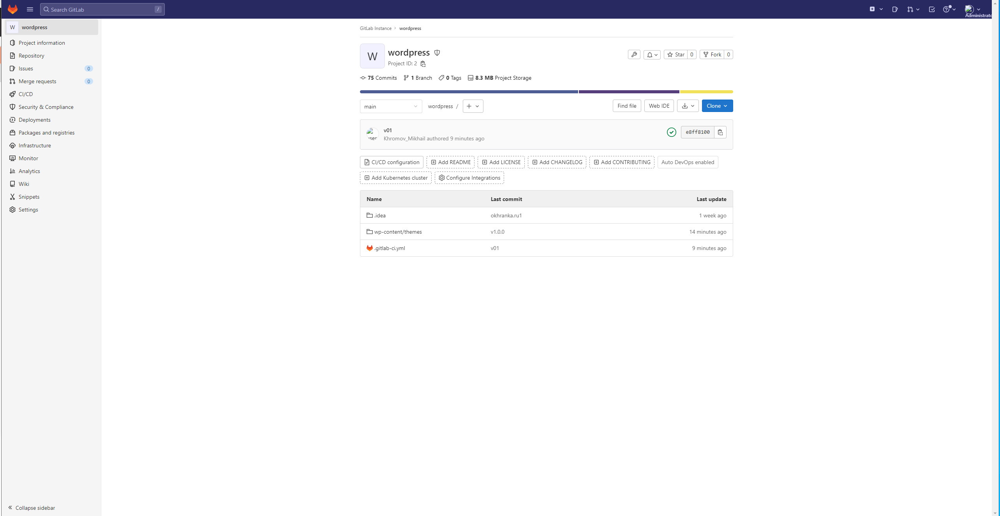

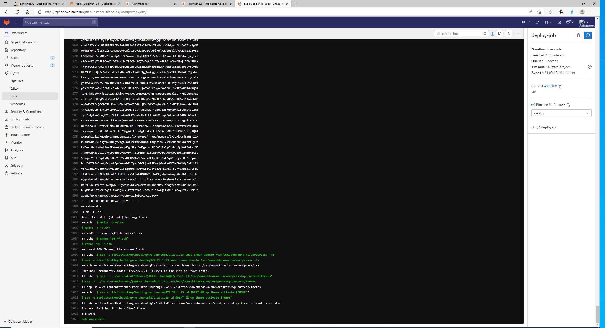

## 7. Установка Prometheus, Alert Manager, Node Exporter и Grafana

Необходимо разработать Ansible роль для установки Prometheus, Alert Manager и Grafana.

Рекомендации:

• Имя сервера: monitoring.you.domain
• Характеристики: 4vCPU, 4 RAM, Internal address.

### Цель:

Получение метрик со всей инфраструктуры.
Ожидаемые результаты:

Интерфейсы Prometheus, Alert Manager и Grafana доступены по https.
В вашей доменной зоне настроены A-записи на внешний адрес reverse proxy:
• https://grafana.you.domain (Grafana)
• https://prometheus.you.domain (Prometheus)
• https://alertmanager.you.domain (Alert Manager)

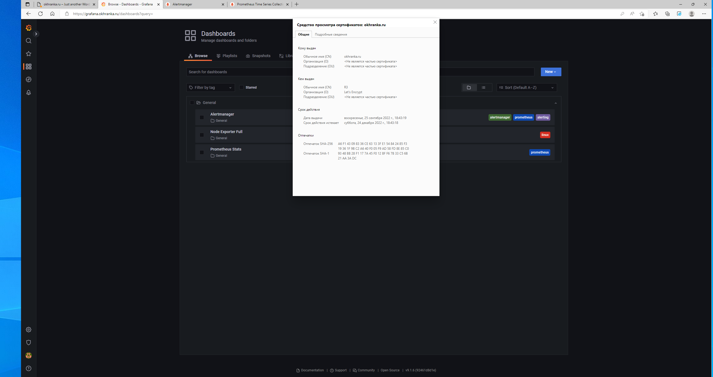
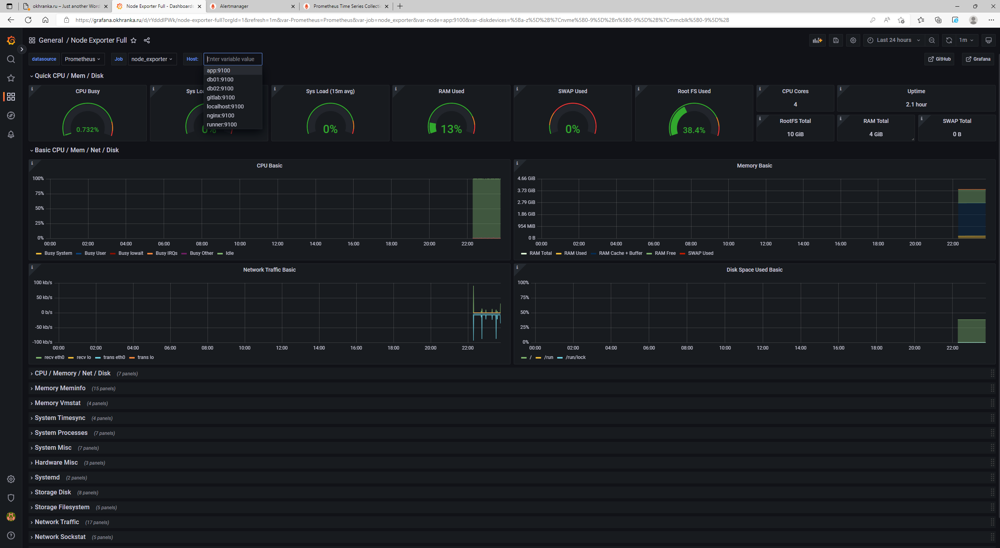
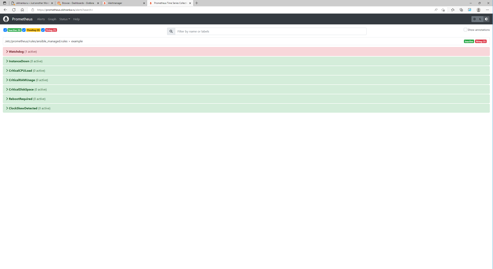
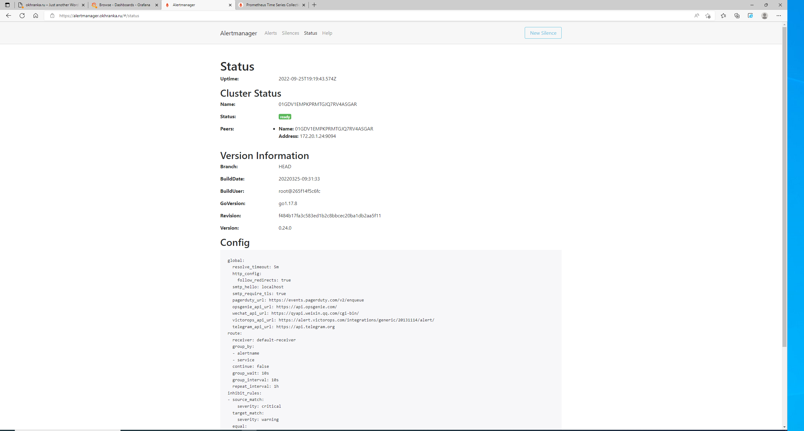

На сервере you.domain отредактированы upstreams для выше указанных URL и они смотрят на виртуальную машину на которой установлены Prometheus, Alert Manager и Grafana.
На всех серверах установлен Node Exporter и его метрики доступны Prometheus.
У Alert Manager есть необходимый набор правил для создания алертов.
В Grafana есть дашборд отображающий метрики из Node Exporter по всем серверам.
В Grafana есть дашборд отображающий метрики из MySQL (*).
В Grafana есть дашборд отображающий метрики из WordPress (*).
Примечание: дашборды со звёздочкой являются опциональными заданиями повышенной сложности их выполнение желательно, но не обязательно.

Что необходимо для сдачи задания?

Репозиторий со всеми Terraform манифестами и готовность продемонстрировать создание всех ресурсов с нуля.
Репозиторий со всеми Ansible ролями и готовность продемонстрировать установку всех сервисов с нуля.
Скриншоты веб-интерфейсов всех сервисов работающих по HTTPS на вашем доменном имени.
https://www.you.domain (WordPress)
https://gitlab.you.domain (Gitlab)
https://grafana.you.domain (Grafana)
https://prometheus.you.domain (Prometheus)
https://alertmanager.you.domain (Alert Manager)
Все репозитории рекомендуется хранить на одном из ресурсов (github.com или gitlab.com).