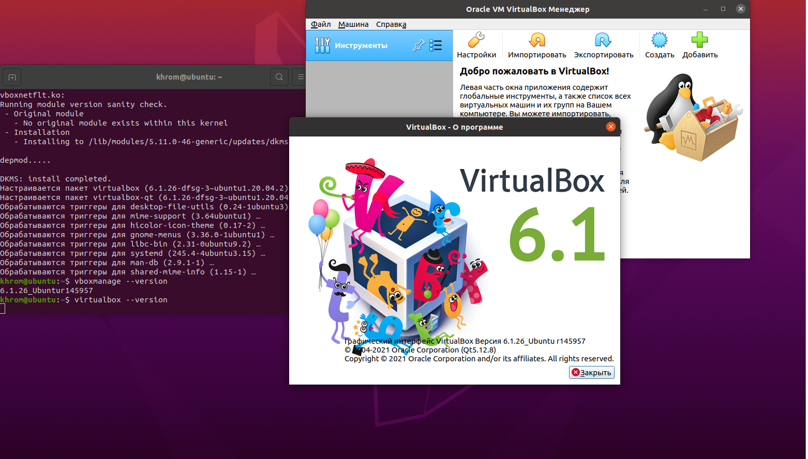
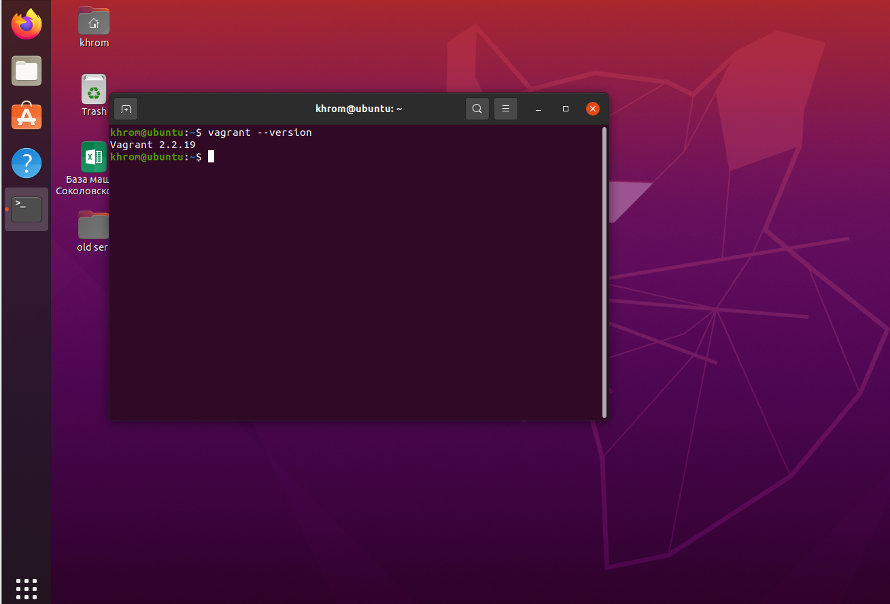
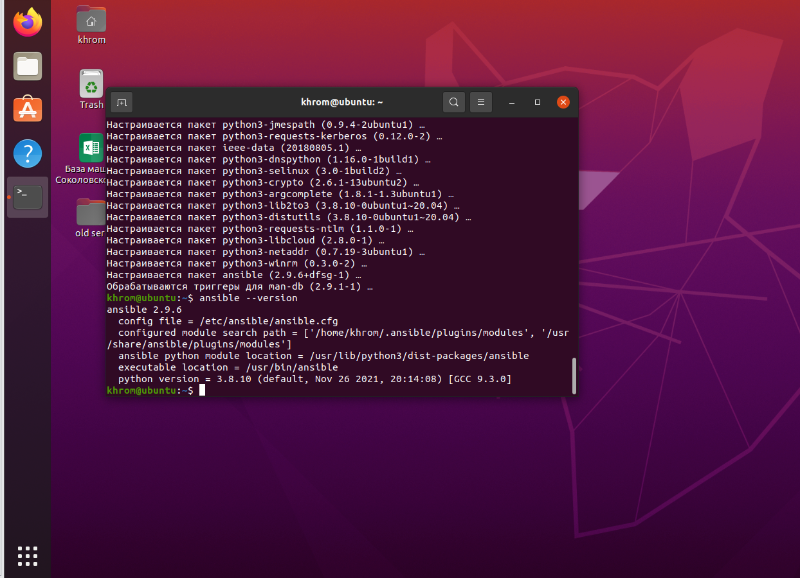

# Домашнее задание к занятию "5.2. Применение принципов IaaC в работе с виртуальными машинами"

## Задача 1

- Опишите своими словами основные преимущества применения на практике IaaC паттернов.

 IaaC паттерны позволяют очень быстро масштабироваться исключив двойную работу. Быстрому росту также способствует универсальность метода на разных средах и этапах разработки

- Какой из принципов IaaC является основополагающим?

 Основополагающим является Идемпоте́нтность (лат.idem — тот же самый + potens — способный)—это свойство объекта или операции, при повторном выполнениикоторой мы получаем результат идентичный предыдущему и всем последующим выполнениям.

## Задача 2

- Чем Ansible выгодно отличается от других систем управление конфигурациями?

Ansible использует протокол SSH , что способствует быстрому внедрению благодаря уже существующему большому опыту работы с ним (протоколом SSH) у специалистов. И уже развёрнутой, в большинстве случаев, инфраструктуре. 

- Какой, на ваш взгляд, метод работы систем конфигурации более надёжный push или pull?

Мне кажется push более простым и как следствие более надёжным, но если оба метода существуют значит есть сторонники и Pull , а кривые руки могут испортить что угодно. 

## Задача 3

Установить на личный компьютер:

- VirtualBox
- Vagrant
- Ansible

 ### VirtualBox

 ### Vagrant

 ### Ansible

