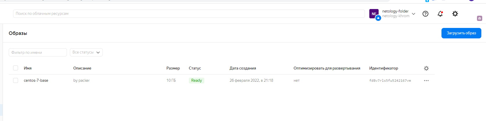
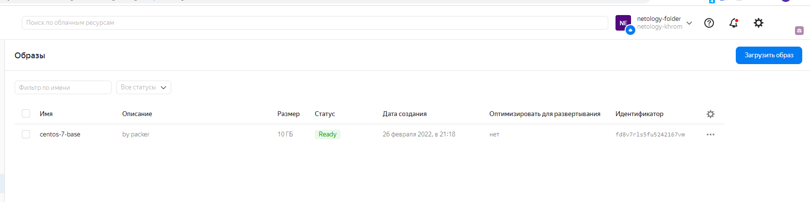
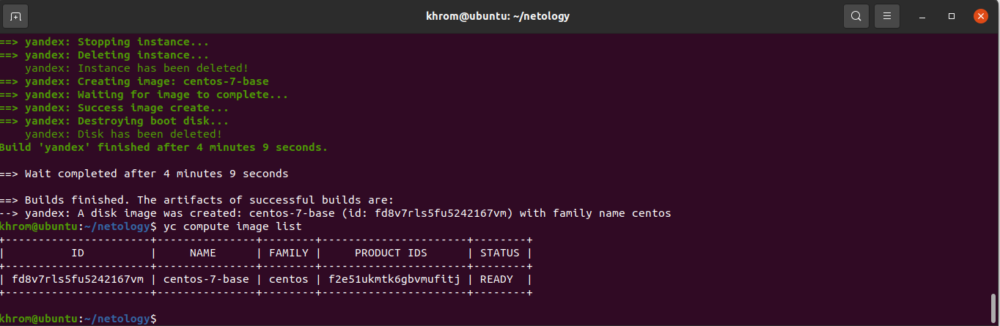

# Домашнее задание к занятию "5.4. Оркестрация группой Docker контейнеров на примере Docker Compose"

## Как сдавать задания

Обязательными к выполнению являются задачи без указания звездочки. Их выполнение необходимо для получения зачета и диплома о профессиональной переподготовке.

Задачи со звездочкой (*) являются дополнительными задачами и/или задачами повышенной сложности. Они не являются обязательными к выполнению, но помогут вам глубже понять тему.

Домашнее задание выполните в файле readme.md в github репозитории. В личном кабинете отправьте на проверку ссылку на .md-файл в вашем репозитории.

Любые вопросы по решению задач задавайте в чате учебной группы.

---

## Задача 1

Создать собственный образ операционной системы с помощью Packer.

Для получения зачета, вам необходимо предоставить:
- Скриншот страницы, как на слайде из презентации (слайд 37).

### Устанавливаем Packer

```
curl -fsSL https://apt.releases.hashicorp.com/gpg | sudo apt-key add -
sudo apt-add-repository "deb [arch=amd64] https://apt.releases.hashicorp.com $(lsb_release -cs) main"
sudo apt-get update && sudo apt-get install packer

```
### Устанавливаем yc
```
curl https://storage.yandexcloud.net/yandexcloud-yc/install.sh | bash
```
### Инициализация yc

```
yc init

```
### Создание сети и настройка подсети 

```
khrom@ubuntu:~/netology$ yc vpc network create --name net --labels my-label=netology-khrom \
> --description "network khrom"
id: enphq0l88bftvujh5n7q
folder_id: b1g0nmleb1hnugk4kb9g
created_at: "2022-02-26T17:20:43Z"
name: net
description: network khrom
labels:
  my-label: netology-khrom

khrom@ubuntu:~/netology$ yc vpc subnet create --name my-subnet-a --zone ru-central1-a --range 10.1.2.0/24 \
> --network-name net --description "subnet khrom"
id: e9botm5o848bo23ttidm
folder_id: b1g0nmleb1hnugk4kb9g
created_at: "2022-02-26T17:22:21Z"
name: my-subnet-a
description: subnet khrom
network_id: enphq0l88bftvujh5n7q
zone_id: ru-central1-a
v4_cidr_blocks:
- 10.1.2.0/24


```

### Просмотр id созданного

```
khrom@ubuntu:~/netology$  yc vpc network list-subnets net
+----------------------+-------------+----------------------+----------------------+----------------+---------------+---------------+
|          ID          |    NAME     |      FOLDER ID       |      NETWORK ID      | ROUTE TABLE ID |     ZONE      |     RANGE     |
+----------------------+-------------+----------------------+----------------------+----------------+---------------+---------------+
| e9botm5o848bo23ttidm | my-subnet-a | b1g0nmleb1hnugk4kb9g | enphq0l88bftvujh5n7q |                | ru-central1-a | [10.1.2.0/24] |
+----------------------+-------------+----------------------+----------------------+----------------+---------------+---------------+


```

### Проверка и запуск сборки образа

```
khrom@ubuntu:~/netology$ packer --version
1.7.10
khrom@ubuntu:~/netology$ packer validate centos-7-base.json
The configuration is valid.
khrom@ubuntu:~/netology$ packer build centos-7-base.json
yandex: output will be in this color.

==> yandex: Creating temporary RSA SSH key for instance...
==> yandex: Using as source image: fd8jpf08c7koo4cp33rk (name: "centos-7-v20220221", family: "centos-7")
==> yandex: Use provided subnet id enphq0l88bftvujh5n7q
==> yandex: Creating disk...
==> yandex: Creating instance...


```


### Итог сборки


```
khrom@ubuntu:~/netology$ yc compute image list
+----------------------+---------------+--------+----------------------+--------+
|          ID          |     NAME      | FAMILY |     PRODUCT IDS      | STATUS |
+----------------------+---------------+--------+----------------------+--------+
| fd8v7rls5fu5242167vm | centos-7-base | centos | f2e51ukmtk6gbvmufitj | READY  |
+----------------------+---------------+--------+----------------------+--------+
```









## Задача 2

Создать вашу первую виртуальную машину в Яндекс.Облаке.

Для получения зачета, вам необходимо предоставить:
- Скриншот страницы свойств созданной ВМ, как на примере ниже:

<p align="center">
  
</p>


##

```

```

###

```

```

###


###

```

```

###

```

```

###


###

```

```

###

```

```


## Задача 3

Создать ваш первый готовый к боевой эксплуатации компонент мониторинга, состоящий из стека микросервисов.

Для получения зачета, вам необходимо предоставить:
- Скриншот работающего веб-интерфейса Grafana с текущими метриками, как на примере ниже
<p align="center">
  
</p>

## Задача 4 (*)

Создать вторую ВМ и подключить её к мониторингу развёрнутому на первом сервере.

Для получения зачета, вам необходимо предоставить:
- Скриншот из Grafana, на котором будут отображаться метрики добавленного вами сервера.

