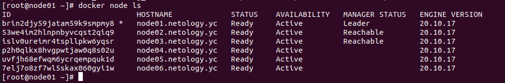
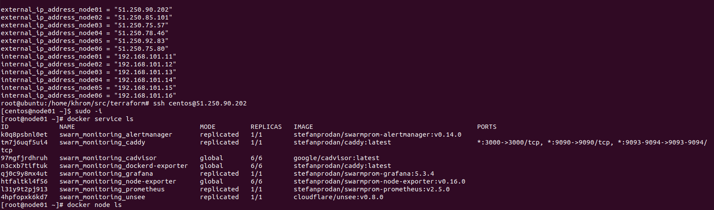
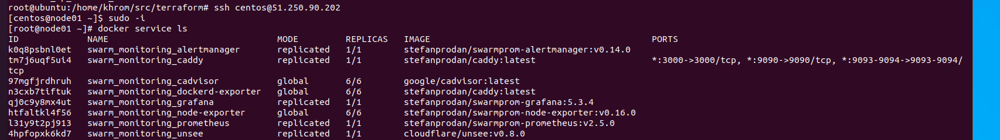

# Домашнее задание к занятию "5.5. Оркестрация кластером Docker контейнеров на примере Docker Swarm"

## Как сдавать задания

Обязательными к выполнению являются задачи без указания звездочки. Их выполнение необходимо для получения зачета и диплома о профессиональной переподготовке.

Задачи со звездочкой (*) являются дополнительными задачами и/или задачами повышенной сложности. Они не являются обязательными к выполнению, но помогут вам глубже понять тему.

Домашнее задание выполните в файле readme.md в github репозитории. В личном кабинете отправьте на проверку ссылку на .md-файл в вашем репозитории.

Любые вопросы по решению задач задавайте в чате учебной группы.

---

## Задача 1

Дайте письменые ответы на следующие вопросы:

- В чём отличие режимов работы сервисов в Docker Swarm кластере: replication и global?

### Ответ:

global - это режим, который выполняет одну задачу на каждом узле. При таком режиме на отдельной ноде может запускаться один экземпляр приложения.

replication это режим в котором может быть запущенно несколько экземпляров приложения равномерно распределённые между нодами.

- Какой алгоритм выбора лидера используется в Docker Swarm кластере?

### Ответ:

Отказоустойчивость сервиса гарантируется самим Docker, а называемый алгоритм поддержания распределенного консенсуса — Raft.

- Что такое Overlay Network?

### Ответ:

Overlay network : Создает внутреннюю частную сеть, которая охватывает все узлы, участвующие в кластере swarm.
Таким образом, оверлейные сети облегчают обмен данными между сервисом Docker Swarm 
и автономным контейнером или между двумя автономными контейнерами на разных демонах Docker.
Эта стратегия устраняет необходимость в маршрутизации на уровне операционной системы между этими контейнерами.

## Задача 2

Создать ваш первый Docker Swarm кластер в Яндекс.Облаке

Для получения зачета, вам необходимо предоставить скриншот из терминала (консоли), с выводом команды:
```
docker node ls
```



## Задача 3

Создать ваш первый, готовый к боевой эксплуатации кластер мониторинга, состоящий из стека микросервисов.

Для получения зачета, вам необходимо предоставить скриншот из терминала (консоли), с выводом команды:
```
docker service ls
```



## Задача 4 (*)

Выполнить на лидере Docker Swarm кластера команду (указанную ниже) и дать письменное описание её функционала, что она делает и зачем она нужна:
```
# см.документацию: https://docs.docker.com/engine/swarm/swarm_manager_locking/
docker swarm update --autolock=true
```

