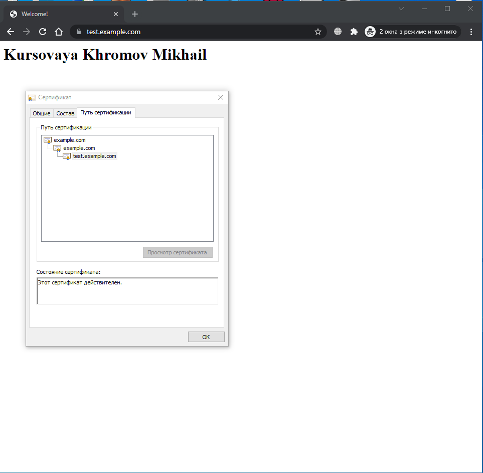

# Курсовая работа по итогам модуля "DevOps и системное администрирование"

Курсовая работа необходима для проверки практических навыков, полученных в ходе прохождения курса "DevOps и системное администрирование".

Мы создадим и настроим виртуальное рабочее место. Позже вы сможете использовать эту систему для выполнения домашних заданий по курсу

## Задание

# Задание 1. Создайте виртуальную машину Linux.
 

### Ответ:

```bash
login as: khrom
khrom@192.168.99.40's password:
Welcome to Ubuntu 20.04.3 LTS (GNU/Linux 5.11.0-44-generic x86_64)

 * Documentation:  https://help.ubuntu.com
 * Management:     https://landscape.canonical.com
 * Support:        https://ubuntu.com/advantage

0 updates can be applied immediately.

Your Hardware Enablement Stack (HWE) is supported until April 2025.
Last login: Wed Jan  5 12:10:09 2022 from 192.168.99.30
khrom@ubuntu:~$


```
# Задание 2. Установите ufw и разрешите к этой машине сессии на порты 22 и 443, при этом трафик на интерфейсе localhost (lo) должен ходить свободно на все порты.
 

### Ответ:

По умолчанию пакет уже установлен запускаем 

```bash
root@ubuntu:/home/khrom# ufw enable
Command may disrupt existing ssh connections. Proceed with operation (y|n)? y
Firewall is active and enabled on system startup

```

Разрешаем 22 порт по имени службы и проверяем статус

```bash
root@ubuntu:/home/khrom# ufw allow ssh
root@ubuntu:/home/khrom#  ufw status
Status: active

To                         Action      From
--                         ------      ----
22/tcp                     ALLOW       Anywhere
22/tcp (v6)                ALLOW       Anywhere (v6)


```
Разрешаем 443 порт по имени службы и проверяем статус


```bash
root@ubuntu:/home/khrom# sudo ufw allow https
Rule added
Rule added (v6)

root@ubuntu:/home/khrom# ufw status
Status: active

To                         Action      From
--                         ------      ----
22/tcp                     ALLOW       Anywhere
443/tcp                    ALLOW       Anywhere
22/tcp (v6)                ALLOW       Anywhere (v6)
443/tcp (v6)               ALLOW       Anywhere (v6)


```
Добавляем правила для хождения трафика через интерфейс localhost

```bash
root@ubuntu:/home/khrom# sudo ufw allow in on lo0
Rule added
Rule added (v6)
root@ubuntu:/home/khrom# sudo ufw allow out on lo0
Rule added
Rule added (v6)
root@ubuntu:/home/khrom# ufw status
Status: active

To                         Action      From
--                         ------      ----
22/tcp                     ALLOW       Anywhere
443/tcp                    ALLOW       Anywhere
Anywhere on lo0            ALLOW       Anywhere
22/tcp (v6)                ALLOW       Anywhere (v6)
443/tcp (v6)               ALLOW       Anywhere (v6)
Anywhere (v6) on lo0       ALLOW       Anywhere (v6)

Anywhere                   ALLOW OUT   Anywhere on lo0
Anywhere (v6)              ALLOW OUT   Anywhere (v6) on lo0


```


# Задание 3. Установите hashicorp vault ([инструкция по ссылке](https://learn.hashicorp.com/tutorials/vault/getting-started-install?in=vault/getting-started#install-vault)).
 

### Ответ:

```bash
root@ubuntu:/home/khrom# curl -fsSL https://apt.releases.hashicorp.com/gpg | sudo apt-key add -
OK
root@ubuntu:/home/khrom# apt-add-repository "deb [arch=amd64] https://apt.releases.hashicorp.com $(lsb_release -cs) main"
Get:1 https://apt.releases.hashicorp.com focal InRelease [9,495 B]
Hit:2 http://us.archive.ubuntu.com/ubuntu focal InRelease
Get:3 http://us.archive.ubuntu.com/ubuntu focal-updates InRelease [114 kB]
Get:4 https://apt.releases.hashicorp.com focal/main amd64 Packages [41.2 kB]
Get:5 http://us.archive.ubuntu.com/ubuntu focal-backports InRelease [108 kB]
Get:6 http://us.archive.ubuntu.com/ubuntu focal-updates/main amd64 Packages [1,445 kB]
Get:7 http://us.archive.ubuntu.com/ubuntu focal-updates/main i386 Packages [581 kB]
Get:8 http://us.archive.ubuntu.com/ubuntu focal-updates/main Translation-en [289 kB]
Get:9 http://us.archive.ubuntu.com/ubuntu focal-updates/main amd64 c-n-f Metadata [14.7 kB]
Get:10 http://us.archive.ubuntu.com/ubuntu focal-updates/restricted amd64 Packages [663 kB]
Get:11 http://us.archive.ubuntu.com/ubuntu focal-updates/restricted Translation-en [94.6 kB]
Get:12 http://us.archive.ubuntu.com/ubuntu focal-updates/universe amd64 Packages [892 kB]
Get:13 http://us.archive.ubuntu.com/ubuntu focal-updates/universe i386 Packages [662 kB]
Get:14 http://us.archive.ubuntu.com/ubuntu focal-updates/universe Translation-en [195 kB]
Get:15 http://us.archive.ubuntu.com/ubuntu focal-updates/universe amd64 c-n-f Metadata [20.0 kB]
Get:16 http://us.archive.ubuntu.com/ubuntu focal-backports/universe amd64 Packages [19.2 kB]
Get:17 http://us.archive.ubuntu.com/ubuntu focal-backports/universe i386 Packages [10.9 kB]
Get:18 http://us.archive.ubuntu.com/ubuntu focal-backports/universe Translation-en [13.3 kB]
Get:19 http://us.archive.ubuntu.com/ubuntu focal-backports/universe amd64 c-n-f Metadata [656 B]
Err:20 http://security.ubuntu.com/ubuntu focal-security InRelease
  Temporary failure resolving 'security.ubuntu.com'
Fetched 5,172 kB in 15s (343 kB/s)
Reading package lists... Done
W: Failed to fetch http://security.ubuntu.com/ubuntu/dists/focal-security/InRelease  Temporary failure resolving 'security.ubuntu.com'
W: Some index files failed to download. They have been ignored, or old ones used instead.
root@ubuntu:/home/khrom#


```


Проверка обновлений и установка vault


```bash
root@ubuntu:/home/khrom# apt update && sudo apt install vault

```
Проверяем установку vault

```bash
root@ubuntu:/home/khrom# vault
Usage: vault <command> [args]

Common commands:
    read        Read data and retrieves secrets
    write       Write data, configuration, and secrets
    delete      Delete secrets and configuration
    list        List data or secrets
    login       Authenticate locally
    agent       Start a Vault agent
    server      Start a Vault server
    status      Print seal and HA status
    unwrap      Unwrap a wrapped secret

Other commands:
    audit          Interact with audit devices
    auth           Interact with auth methods
    debug          Runs the debug command
    kv             Interact with Vault's Key-Value storage
    lease          Interact with leases
    monitor        Stream log messages from a Vault server
    namespace      Interact with namespaces
    operator       Perform operator-specific tasks
    path-help      Retrieve API help for paths
    plugin         Interact with Vault plugins and catalog
    policy         Interact with policies
    print          Prints runtime configurations
    secrets        Interact with secrets engines
    ssh            Initiate an SSH session
    token          Interact with tokens

```

# Задание 4. Cоздайте центр сертификации по инструкции ([ссылка](https://learn.hashicorp.com/tutorials/vault/pki-engine?in=vault/secrets-management)) и выпустите сертификат для использования его в настройке веб-сервера nginx (срок жизни сертификата - месяц).
 

### Ответ:

Запуск сервера

```bash
khrom@ubuntu:~$ vault server -dev -dev-root-token-id root
==> Vault server configuration:

             Api Address: http://127.0.0.1:8200
                     Cgo: disabled
         Cluster Address: https://127.0.0.1:8201
              Go Version: go1.17.5
              Listener 1: tcp (addr: "127.0.0.1:8200", cluster address: "127.0.0.1:8201", max_request_duration: "1m30s", max_request_size: "33554432", tls: "disabled")
               Log Level: info
                   Mlock: supported: true, enabled: false
           Recovery Mode: false
                 Storage: inmem
                 Version: Vault v1.9.2
             Version Sha: f4c6d873e2767c0d6853b5d9ffc77b0d297bfbdf

```
 Экспорт переменных и выпуск корневого сертификата

```bash
khrom@ubuntu:~$ export VAULT_ADDR='http://127.0.0.1:8200'
khrom@ubuntu:~$ export VAULT_TOKEN=root
khrom@ubuntu:~$ vault secrets enable pki
Success! Enabled the pki secrets engine at: pki/
khrom@ubuntu:~$ vault secrets tune -max-lease-ttl=87600h pki
Success! Tuned the secrets engine at: pki/
khrom@ubuntu:~$ vault write -field=certificate pki/root/generate/internal \
>      common_name="example.com" \
>      ttl=87600h > CA_cert.crt
khrom@ubuntu:~$ vault write pki/config/urls \
>      issuing_certificates="$VAULT_ADDR/v1/pki/ca" \
>      crl_distribution_points="$VAULT_ADDR/v1/pki/crl"
Success! Data written to: pki/config/urls
khrom@ubuntu:~$

```

 Выпуск промежуточного сертификата

```bash
khrom@ubuntu:~$ vault secrets enable -path=pki_int pki
Success! Enabled the pki secrets engine at: pki_int/
khrom@ubuntu:~$ vault secrets tune -max-lease-ttl=43800h pki_int
Success! Tuned the secrets engine at: pki_int/
khrom@ubuntu:~$ vault write -format=json pki_int/intermediate/generate/internal \
>      common_name="example.com Intermediate Authority" \
>      | jq -r '.data.csr' > pki_intermediate.csr

Command 'jq' not found, but can be installed with:

sudo snap install jq  # version 1.5+dfsg-1, or
sudo apt  install jq  # version 1.6-1ubuntu0.20.04.1

See 'snap info jq' for additional versions.

khrom@ubuntu:~$ sudo apt  install jq

khrom@ubuntu:~$ vault write -format=json pki_int/intermediate/generate/internal \
>      common_name="example.com " \
>      | jq -r '.data.csr' > pki_intermediate.csr
khrom@ubuntu:~$ vault write -format=json pki/root/sign-intermediate csr=@pki_intermediate.csr \
>      format=pem_bundle ttl="43800h" \
>      | jq -r '.data.certificate' > intermediate.cert.pem
khrom@ubuntu:~$ vault write pki_int/intermediate/set-signed certificate=@intermediate.cert.pem
Success! Data written to: pki_int/intermediate/set-signed
khrom@ubuntu:~$


```
 Создание роли

```bash

khrom@ubuntu:~$ vault write pki_int/roles/example-dot-com \
>      allowed_domains="example.com" \
>      allow_subdomains=true \
>      max_ttl="720h"
Success! Data written to: pki_int/roles/example-dot-com
khrom@ubuntu:~$


```
Запрос сертификата на месяц и подготовка сертификатов

```bash


``````bash
root@ubuntu:/home/khrom# vault write -format=json pki_int/issue/example-dot-com common_name="test.example.com" ttl="720h" > /etc/ssl/test_example.crt


root@ubuntu:/home/khrom# cat /etc/ssl/test_example.crt | jq -r .data.certificate > /etc/ssl/test_example.crt.pem
root@ubuntu:/home/khrom# cat /etc/ssl/test_example.crt | jq -r .data.ca_chain[] >> /etc/ssl/test_example.crt.pem
root@ubuntu:/home/khrom# cat /etc/ssl/test_example.crt | jq -r .data.private_key > /etc/ssl/test.example.com.crt.key


``````bash


```

# Задание 5. Установите корневой сертификат созданного центра сертификации в доверенные в хостовой системе.
 

### Ответ:

```bash
khrom@srv-1:~$ cd /usr/local/share/ca-certificates
khrom@srv-1:/usr/local/share/ca-certificates$ sudo scp khrom@192.168.99.40:/home/khrom/CA_cert.crt .
khrom@srv-1:~$ sudo dpkg-reconfigure ca-certificates

```
# Задание 6. Установите nginx.
 

### Ответ:

```bash
root@ubuntu:/home/khrom# apt install nginx
Чтение списков пакетов… Готово
...

root@ubuntu:~# systemctl status nginx
● nginx.service - A high performance web server and a reverse proxy server
     Loaded: loaded (/lib/systemd/system/nginx.service; enabled; vendor preset: enabled)
     Active: active (running) since Sat 2022-01-15 02:43:03 MSK; 55min ago
       Docs: man:nginx(8)
    Process: 10148 ExecStartPre=/usr/sbin/nginx -t -q -g daemon on; master_process on; (code=exited, status=0/SUCCESS)
    Process: 10149 ExecStart=/usr/sbin/nginx -g daemon on; master_process on; (code=exited, status=0/SUCCESS)
   Main PID: 10150 (nginx)
      Tasks: 3 (limit: 4599)
     Memory: 3.3M
     CGroup: /system.slice/nginx.service
             ├─10150 nginx: master process /usr/sbin/nginx -g daemon on; master_process on;
             ├─10151 nginx: worker process
             └─10152 nginx: worker process


```
# Задание 7. По инструкции ([ссылка](https://nginx.org/en/docs/http/configuring_https_servers.html)) настройте nginx на https, используя ранее подготовленный сертификат:
  - можно использовать стандартную стартовую страницу nginx для демонстрации работы сервера;
  - можно использовать и другой html файл, сделанный вами;


### Ответ:

```bash
root@ubuntu:/home/khrom# mkdir -p /var/www/example/html
root@ubuntu:/home/khrom# chown -R $USER:$USER /var/www/example/html
root@ubuntu:/home/khrom# sudo chmod -R 755 /var/www/example


root@ubuntu:/home/khrom# nano /etc/nginx/sites-available/example

server {

      listen              443 ssl;

      server_name         www.test.example.com test.example.com;
      ssl_certificate     /etc/ssl/test_example.crt.pem;
      ssl_certificate_key /etc/ssl/test.example.com.crt.key;

       root /var/www/example/html;
       index index.html;

       location / {
               try_files $uri $uri/ =404;
       }
}


root@ubuntu:/home/khrom# ln -s /etc/nginx/sites-available/example /etc/nginx/sites-enabled/


```

```bash

root@ubuntu:/home/khrom# nginx -t
nginx: the configuration file /etc/nginx/nginx.conf syntax is ok
nginx: configuration file /etc/nginx/nginx.conf test is successful

root@ubuntu:/home/khrom# systemctl restart nginx


```
# Задание 8. Откройте в браузере на хосте https адрес страницы, которую обслуживает сервер nginx.
 

### Ответ:



# Задание 9. Создайте скрипт, который будет генерировать новый сертификат в vault:
  - генерируем новый сертификат так, чтобы не переписывать конфиг nginx;
  - перезапускаем nginx для применения нового сертификата.
 

### Ответ:

```bash

#!/usr/bin/env bash

#Генерация сертификата

 vault write -format=json pki_int/issue/example-dot-com common_name="test.example.com" ttl="720h" > /etc/ssl/test_example.crt

# Подготовка сертификата

 cat /etc/ssl/test_example.crt | jq -r .data.certificate > /etc/ssl/test_example.crt.pem
 cat /etc/ssl/test_example.crt | jq -r .data.ca_chain[] >> /etc/ssl/test_example.crt.pem
 cat /etc/ssl/test_example.crt | jq -r .data.private_key > /etc/ssl/test.example.com.crt.key

# Перезапускаем nginx для применения нового сертификата.

 systemctl restart nginx


```
# Задание 10. Поместите скрипт в crontab, чтобы сертификат обновлялся какого-то числа каждого месяца в удобное для вас время.
 

### Ответ:

```bash

root@ubuntu:/home/khrom# crontab -l
# Edit this file to introduce tasks to be run by cron.
#
# Each task to run has to be defined through a single line
# indicating with different fields when the task will be run
# and what command to run for the task
#
# To define the time you can provide concrete values for
# minute (m), hour (h), day of month (dom), month (mon),
# and day of week (dow) or use '*' in these fields (for 'any').
#
# Notice that tasks will be started based on the cron's system
# daemon's notion of time and timezones.
#
# Output of the crontab jobs (including errors) is sent through
# email to the user the crontab file belongs to (unless redirected).
#
# For example, you can run a backup of all your user accounts
# at 5 a.m every week with:
# 0 5 * * 1 tar -zcf /var/backups/home.tgz /home/
#
# For more information see the manual pages of crontab(5) and cron(8)
#
# m h  dom mon dow   command


0 0 1 * * /home/khrom/sert.sh


```


